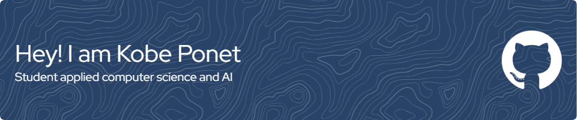

Welcome to my GitHub profile! I'm passionate about technology and love to create, and learn. This README serves as an introduction to who I am, what I do, and how you can connect with me.

### 🎓 About Me

I'm a second-year student at KdG, pursuing a degree in Applied Computer Science and AI. My academic journey is focused on gaining a deep understanding of computer science principles and the exciting world of artificial intelligence. I'm passionate about leveraging technology to solve real-world problems and am constantly seeking opportunities to apply what I've learned in the classroom to practical projects.

### 🌟 My Academic Interests

- 🤖 Artificial Intelligence and Machine Learning
- 🌐 Web Development
- 📊 Data Science and Analytics
- 📱 App Development

My coursework and research at KdG have equipped me with valuable skills and knowledge in these areas, and I'm eager to continue honing my expertise.

### 📫 How to Reach Me

- 📧 Email: ponetkobe@gmail.com
- 💼 LinkedIn: [My LinkedIn Profile](linkedin.com/in/kobeponet/)
- 🌐 Website: /

Feel free to connect with me on any of these platforms. I'm always open to new opportunities, collaborations, or just a friendly chat!

### 🤝 Let's Collaborate

I'm always looking for exciting collaborations and opportunities to learn and grow. If you have a project in mind or would like to connect, please don't hesitate to reach out.

Thank you for visiting my GitHub profile! I look forward to connecting with you and exploring the exciting world of technology together. 😄

